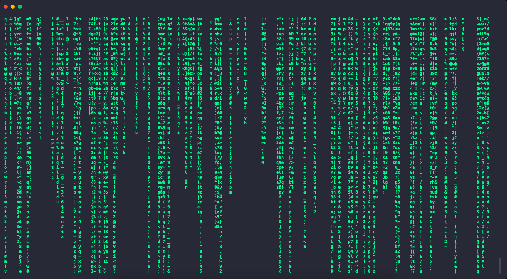

# Enter to the Matrix (with Symfony Console)

Reproduction of the "Matrix characterfall" effect with the Symfony Console component.



## Run

Clone the project

```bash
  git clone https://github.com/yoanbernabeu/Enter-to-the-Matrix-with-Symfony-Console.git
```

Go to the project directory

```bash
  cd Enter-to-the-Matrix-with-Symfony-Console/
```

Install dependencies

```bash
  composer install
```

Enter to the Matrix

```bash
  symfony console app:matrix
```

## Requirements

- PHP 7.4^
- Symfony CLI
- Git
- Composer
- Sense of humor

## Author

- [@yoanbernabeu](https://github.com/yoanbernabeu)

- Thanks [@ponceto](https://gist.github.com/ponceto/b7bc2c5beb56b2441dfbc29da34e0560) for the idea